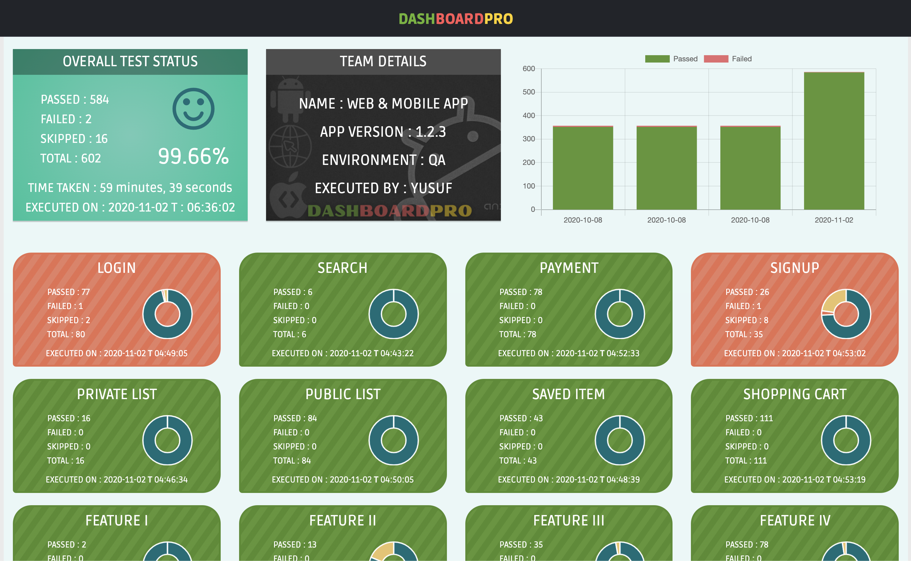

<h1 align="center">
    
     
</h1>

    
    &nbsp;&nbsp;
    
    &nbsp;&nbsp;
    
    &nbsp;&nbsp;
    
 

## DashBoardPro
&nbsp;&nbsp;&nbsp;&nbsp;&nbsp;&nbsp;Provides a powerfull real-time reporting dashboard for automated test results, visualize your last execution with cool charts and show What Went Right and What Went Wrong. 
&nbsp;&nbsp;&nbsp;&nbsp;&nbsp;&nbsp;Ease of integration with any existing automated process made simple to use.
 
## Screenshots

## Installation

    npm i dashboardpro

or

    npm install dashboardpro --save

## How to use?

Save the below code into any file. ex, index.js

    # index.js
    const dashboard = require('dashboardpro');
    dashboard.createjsfiles("./results");

Run the index.js file in node

    node index.js

## How host the dashboard in gitlab as pages?

#### For GITLAB:

    #.gitlab-ci.yml 
    image: node:latest

    pages:
        stage: deploy
        script:
            - npm install
            - npm update
            - node index.js
            - mv report public

        artifacts:
            paths:
            - public
        
        only:
        - master

    
## **Like it?** :thumbsup:

Click the star icon :star: at the top-right corner of this page to show your appreciation.

## **Contribute**

We're open to any contribution. It has to be tested properly though.

## **License**

Copyright © 2020 [MIT License](LICENSE)
